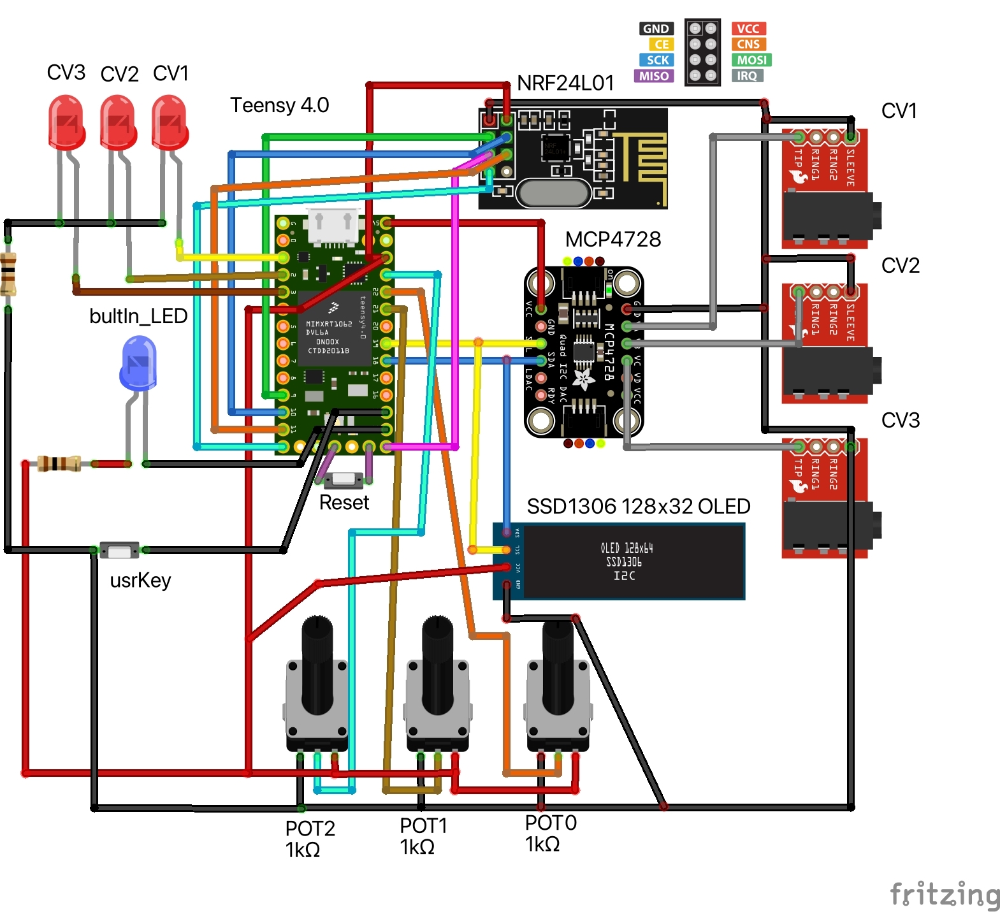
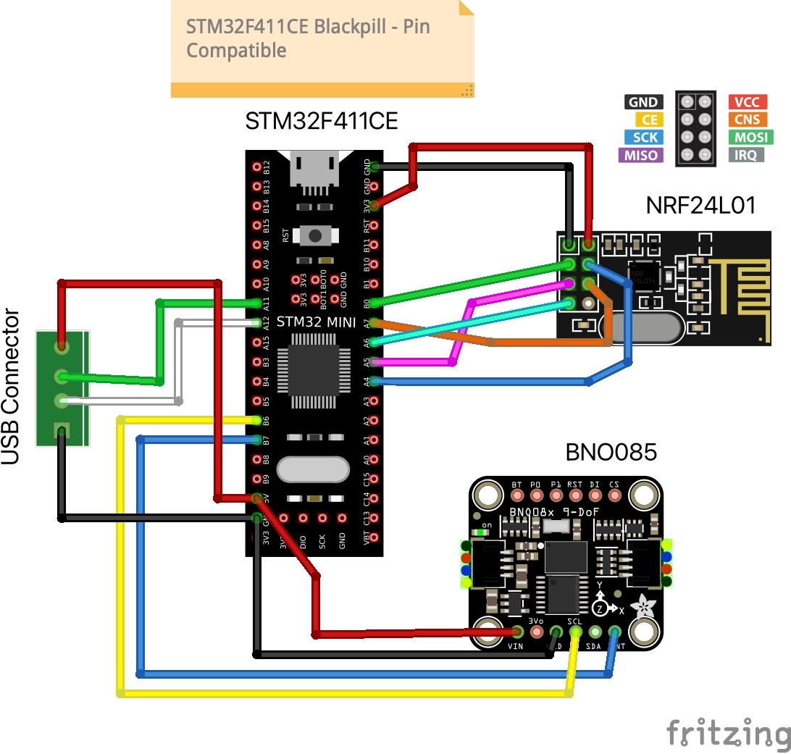

# PendulumSynth

<!-- 

 -->
PendulumSynth is an on-going and open-source project, running on Arduino platform with the goal of mixing real-world physics into music composition and musical performance. 
A network of pendulums with built-in IMU systems can be used to create rhythms and effects, manipulating music in real-time. 
 More info on Hackaday Posting: https://hackaday.io/project/182341-pendulumsynth 

## Components
Master:
- [Teensy 4.0](https://www.pjrc.com/store/teensy40.html "Teensy 4.0 Homepage")
- [MCP4728](https://www.adafruit.com/product/4470 "Buy here")
- NRF24L01
- SSD1306 128x32 OLED Display
- 3X 1KΩ Potentiometers
- 4X LEDs
- 3X 3.5mm Audio Jacks 

Node:
- [STM32F411CE - BlackPill](https://stm32-base.org/boards/STM32F411CEU6-WeAct-Black-Pill-V2.0.html "More Info")
- [BNO085](https://www.adafruit.com/product/4754 "Buy here")
- NRF24L01
 

## System Design

 

## Schematics

 

## Images

 

## Demo Video
https://user-images.githubusercontent.com/19628148/138608542-8e42e0b6-f3e0-4e13-86f7-b399832cbad7.mp4

 
 
https://youtu.be/r7tXlfV4hvE
 
